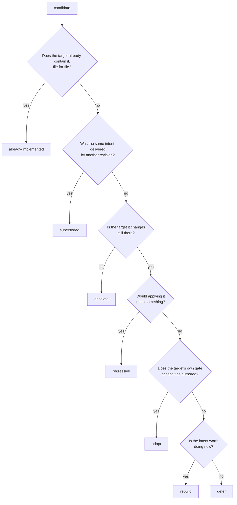

# Merge decision

```dsl
DOCUMENT MERGE_DECISION
VERSION 2
LANGUAGE EN
MODE STRICT
DECISION_SCHEMA = "wellmanifest.merge-decision/v1"
REQUEST_GRAMMAR = "merge-decision.v1.gbnf"
TOOL_BINDINGS = "../standard/tool-bindings.json"
UNRECOVERABLE_SHAPES = [staged-tree, worktree]

RULE MERGE-DECISION-001 TYPE FORBIDDEN
WHEN DISPOSITION_DESTROYS_CANDIDATE AND CANDIDATE_SHAPE IN UNRECOVERABLE_SHAPES
DO REQUIRE RESTORING_ARTIFACT_WRITTEN_AND_VERIFIED_BEFORE_EFFECT
FORBID DESTROY_WITHOUT_RESTORING_ARTIFACT
ASSERT DECISION_PERFORMS_NO_MERGE_DELETE_PUBLISH_OR_REBASE
```

## Responsibility

This module owns one question: **what happens to work that diverged.** An
orphaned branch, an unpushed commit, a staged tree nobody remembers, a change
that may already be upstream under another name.

It does not merge, delete, publish or rebase anything. It records which
evidence was gathered, which disposition that evidence supports, and what the
decision authorizes someone else to do next. The separation matters because the
expensive mistakes here are silent: deleting work that was never delivered, or
re-applying work that was.

## Candidate shapes

| Shape | Recoverable from git alone | Typical origin |
| --- | --- | --- |
| `remote-branch` | yes | abandoned ticket branch |
| `local-branch` | yes | leftovers after a squashed merge |
| `unpushed-commit` | yes | work committed on a machine and never pushed |
| `pull-request` | yes | open PR that stopped moving |
| `staged-tree` | **no** | a tool run left an index full of changes |
| `worktree` | **no** | a dirty checkout in a forgotten directory |

The last two carry the sharpest rule in this standard: a decision that destroys
them must first write an artifact that restores them. A branch tip is a
reference; a staged tree is nothing once it is gone.

## Dispositions and what each one owes



| Disposition | Meaning | Required evidence |
| --- | --- | --- |
| `adopt` | Merge it as authored. | `gate-outcome`, `reachability` |
| `rebuild` | Intent is live, delivery is not acceptable: re-plan and rebuild the history. | `gate-outcome`, `history-shape` |
| `already-implemented` | The target already has it, byte for byte. | `content-identity` over **every** file |
| `superseded` | The same intent shipped under a different revision. | `patch-equivalence` + the replacing revision |
| `regressive` | Applying it would undo something the target has. | `content-identity` showing divergence |
| `obsolete` | What it changes no longer exists or no longer matters. | `dependency-evidence` |
| `defer` | Intent is live, but not now: record it as backlog. | `intent-delta`, and only effect-free actions |

## Rules that survived contact with real repositories

- **A summary is not identity.** `already-implemented` requires a per-file
  comparison with `compared == total == matched`. "Looks like main" has been
  wrong often enough to be worth a schema field.
- **`git cherry` answers about patches, not intent.** A rewritten delivery of
  the same change still shows `+`. `superseded` therefore names the replacing
  revision explicitly.
- **Absence of a reference is a reason to look, not permission to delete.**
  This is `deconnected`'s own rule and it is adopted verbatim: `obsolete` needs
  positive dependency evidence.
- **Advisory evidence cannot authorize destruction.** An intent-graph delta or
  a model verdict may inform any disposition, but a decision whose entire
  evidence set is non-deterministic must not delete or discard.
- **The destructive flag is derived, not declared.** It must agree with the
  authorized actions, so a decision cannot quietly authorize a deletion while
  presenting itself as safe.
- **Rebuild preserves authorship.** Re-planning someone's work is allowed;
  taking their name off it is not.
- **A receipt cannot exceed its decision.** Executed actions must be a subset
  of what was authorized.
- **The deciding agent does not merge.** `merge` requires an executor that is
  not the interactive agent, and an autonomous merge must evidence all six of
  its preconditions. A required check that never ran is not green
  (`required-checks-not-run`); only the owner may then merge, on cited
  deterministic evidence. See [`AUTONOMOUS_MERGE.md`](AUTONOMOUS_MERGE.md).

## Rules as portable equations

The disposition and destruction rules are written twice: once as this
repository's checker, once as [Env DSL](https://github.com/wellmanifest/env-dsl)
equations in [`standard/merge-rules.env`](../standard/merge-rules.env). Env DSL
is the Wellmanifest contract for constants and conditions expressed as operators
inside equations, so the rules become data that any adapter can evaluate.

The projection is bound the same way this family binds every external contract:
the evaluator is vendored byte-for-byte from `wellmanifest/env-dsl@1d5ed6c`,
its digest is pinned, and it is loaded from the exact file whose digest was
verified rather than through `sys.path`. Facts are projected from a decision
onto `FACT_*` constants; `DECISION_ADMISSIBLE_CONDITION` is the single
conjunction that answers the question.

Two limits are deliberate. Env DSL has no set membership, so an evidence
obligation is projected as one `FACT_HAS_*` boolean per kind rather than as a
subset test. And when a decision cites several content-identity observations,
the projection reads the broadest one; the checker in this repository remains
authoritative for the rest.

The policy prose in `dsl` blocks above follows the
[`policy-dsl`](https://github.com/wellmanifest/policy-dsl) style used by
`wellmanifest/new-project` contributor policy. That language's own grammar is
still under implementation in its `ticket-001`, so these blocks are formatted
for it but not yet checked by it.

## Evidence and producers

Nine evidence kinds, each bound to a producer that can actually answer it, in
[`standard/tool-bindings.json`](../standard/tool-bindings.json). The
deterministic ones — `git` and the target repository's own `gate` — are the
trust root. The `semcod` producers add reach:

- **todo2code** (`t2c compare-workspace`) answers *intent-delta*: whether the
  candidate adds declared intent, restates it, or is a stale subset of the
  target. Rising gaps with flat alignment reads as backlog; large
  `recordsRemoved` with a high behind-count reads as staleness.
- **code2llm** answers *code-liveness*: whether the code the candidate touches
  still exists and is reachable.
- **deconnected** answers *dependency-evidence* across code, routes, services
  and tables before anything shared is called dead.
- **giton** answers *history-shape*: plan-first ordering and `fixup!`-style
  additive correction instead of rewriting authored commits.

## Diagnostics

| Code | Meaning |
| --- | --- |
| `MRG-DOC-001` | Document family or closed field set is invalid. |
| `MRG-REF-001` | A reference is malformed, duplicated, or points at another candidate. |
| `MRG-CANDIDATE-001` | The candidate misdescribes its shape, head or recoverability. |
| `MRG-EVIDENCE-001` | Evidence is unattributed, impossible, or too weak for the claim it carries. |
| `MRG-DECISION-001` | The disposition, its evidence obligation, or its authorized actions are invalid. |
| `MRG-RECOVERY-001` | A destructive decision lacks the artifact that would restore the work. |
| `MRG-RECEIPT-001` | A receipt executed something the decision never authorized. |
| `MRG-MERGE-001` | An interactive agent authorized its own merge, or an autonomous merge lacks evidence of a precondition. |
| `MRG-SECRET-001` | The secret-free rule is violated. |
| `MRG-CONTRACT-001` | The pinned schema, grammar or binding digests do not match. |

`standard/conformance.py --all` proves each code against an adversarial
mutation and pins all four contract digests.
