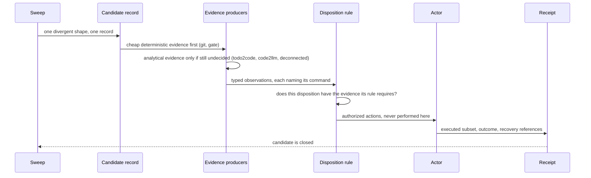

# Merge decision logic flow

The order is deliberate. `git` answers identity and reachability in seconds, and
those two answers close most candidates without any analysis at all. The
target's own governance gate answers the next question — not *whether* to take
the work, but *in what shape* — also in seconds. Only what survives both goes to
the analytical producers, which cost minutes and can only ever inform.

Evidence is typed and attributed: every record names the command that produced
it and whether re-running that command must produce the same observation.
Non-deterministic evidence is admissible everywhere and decisive nowhere; a
decision whose entire evidence set is advisory cannot authorize destruction.

Dispositions fail closed. A disposition without the evidence its own rule
requires is rejected before any action is authorized, which is what stops the
two failure modes this standard exists for: deleting work that was never
delivered, and re-applying work that already was.

Destruction is gated twice. First the decision must carry recoverability
evidence and at least one recovery reference; then, if the candidate is an
uncommitted shape, that reference must be a written patch rather than a git
reference — because restoring a staged tree from git alone is not possible.

Nothing in this flow performs an action. The decision authorizes; a separate
actor executes; the receipt records what was actually done and may never exceed
what was authorized.
